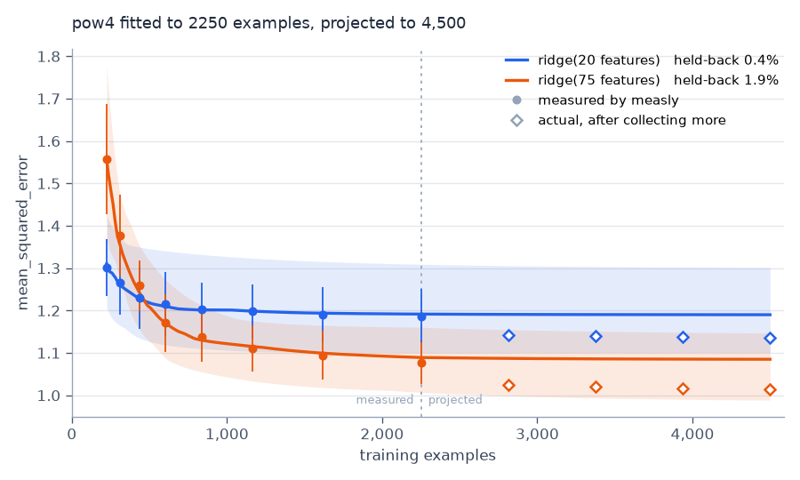

# measly🍽️

More data is always better, but how much better?

measly tries to estimate whether your model is in a data-limited regime or not (i.e. would measuring more samples actually improve performance), for applications where data acquisition is slow and expensive, including but not limited to the life sciences.

## Problem Definition 

measly fits many many models to random subsets of the dataset at different fractions of its size to create an ensemble model.

Each ensemble member is then fitted with a scaling law. The default is `pow4`:

```
L(n) = L∞ + A · (n + d)^(−α)
```

`pow3`, the three-parameter form most of the literature quotes, is the same
thing with `d` fixed at zero:

```
L(n) = L∞ + A · n^(−α)
```


## Quickstart

```sh
pip install git+https://github.com/tremgan/measly
```

Supply a model with `fit`/`predict` and your data. Everything else has a default.

```python
import numpy as np
from sklearn.compose import ColumnTransformer
from sklearn.linear_model import Ridge
from sklearn.pipeline import Pipeline

from measly import analyse, plot


def ridge(capacity):
    """Ridge that sees only the first `capacity` features."""
    return Pipeline([
        ("capacity",
         ColumnTransformer([("keep", "passthrough", slice(0, capacity))])),
        ("ridge", Ridge()),
    ])


rng = np.random.default_rng(0)
weights = np.concatenate([rng.normal(size=4), np.full(71, 0.05)])
X = rng.normal(size=(3000, 75))
y = X @ weights + rng.normal(0, 1.0, 3000)

# Named, because a Pipeline's repr embeds a memory address.
result = analyse({"ridge(20 features)": ridge(20),
                  "ridge(75 features)": ridge(75)}, X, y, rng=0)
print(result.summary())
plot(result, factor=4.0)
```

```
measly: 2 model(s), 2250 training examples, 100 draws
        pow4, mean_squared_error (lower is better)

  ridge(20 features)
    now (2250 examples)      1.1649
    at 4500 examples         1.1564 [1.0968, 1.2498]
    gain from getting there  +0.0020 [+0.0000, +0.0122]
    held-back check          0.7% error

  ridge(75 features)
    now (2250 examples)      1.0333
    at 4500 examples         1.0289 [0.9604, 1.1169]
    gain from getting there  +0.0058 [+0.0005, +0.0224]
    held-back check          1.2% error
```



The capacity question in one figure. At 225 examples the 75-feature model is
18% worse. At 2250 it is 11% better. The curves cross near 400.

That crossover is what a pilot study hides. Measured only at 225 examples you
would have picked the small model, and been wrong about every later round. A
model's rank at one sample size does not give you its rank at the next.

Both gains are small but positive, and the larger model gains about three times
more. That is the answer to "should we collect more": a little, and it is the
high-capacity model that benefits.

The gain interval is far tighter than the loss interval above it, which looks
inconsistent until you see why. Every size in a draw is scored on the same test
set, so that draw's whole curve shifts bodily up or down. That offset dominates
the loss band, and cancels in the gain, because each curve is compared against
its own level rather than an average over draws.

## Does it work?

The process above is synthetic, so the projection can be audited instead of
trusted. [`examples/capacity.py`](examples/capacity.py) draws the extra rows
from the same process, refits at four sizes past the measured range, and scores
on 20,000 held-out rows — the open diamonds in the figure. The larger sets
extend the pilot rather than replacing it, because that is what collecting
more data means. Only the new rows are redrawn across the ten repeats.

```
               model  examples            actual  projected           interval   error
  ridge(20 features)      2812   1.1419 +-0.0019     1.1571   [1.0975, 1.2529]    1.3%
  ridge(20 features)      3375   1.1397 +-0.0020     1.1570   [1.0971, 1.2510]    1.5%
  ridge(20 features)      3938   1.1379 +-0.0023     1.1566   [1.0969, 1.2501]    1.6%
  ridge(20 features)      4500   1.1364 +-0.0020     1.1564   [1.0968, 1.2498]    1.8%
  ridge(75 features)      2812   1.0256 +-0.0031     1.0316   [0.9775, 1.1188]    0.6%
  ridge(75 features)      3375   1.0204 +-0.0031     1.0295   [0.9703, 1.1179]    0.9%
  ridge(75 features)      3938   1.0162 +-0.0033     1.0293   [0.9643, 1.1173]    1.3%
  ridge(75 features)      4500   1.0133 +-0.0028     1.0289   [0.9604, 1.1169]    1.5%
```

All eight land inside their intervals, never more than 1.8% from the median.

Do not read the projected loss as biased either way. Over eight pilots the
projection at 2x sat above what actually happened in 3 of 8 for the nearly flat
model and 5 of 8 for the steeply descending one. The mean error was +0.4% and
+2.4%, and all sixteen intervals held the truth. The scatter comes from
scoring on a slice of your own pilot, not from a systematic lean.

The audit stops at twice the measured pool. The held-back check fits on the
smaller sizes and predicts the largest two, a stretch of about 1.9x, so that
is as far as the method carries evidence. Projecting ten times out would
return a number and support none of it.

Their error bars are smaller than the markers that carry them. Ten independent
collections at one size vary by 0.0019 to 0.0033, while the band spans about
0.15. The band is conservative by roughly two orders of magnitude, which is the
safe direction to be wrong in but worth knowing. Most of that width is test-set
noise, not uncertainty about the curve.

Subsets are drawn without replacement. Each draw resplits the pool, so even the
full-size fit varies across draws. A bootstrap would add little to that spread
and would bias the level up, because a resample repeats rows.

`analyse` always checks itself. It refits the curves on the smaller sample
sizes, predicts the largest ones you already measured, and reports the error.
Above 15% the projection MUST NOT be relied on: the shape fits your data but
does not predict it.

`analyse(...).results` is an `xarray.DataArray` over `(fraction, model, draw)`
if you want the raw measurements.

## Previous work in this area/Inspiration

- [The Shape of Learning Curves: a Review](https://arxiv.org/abs/2103.10948). Viering & Loog, 2021.
- [Deep Learning Scaling is Predictable, Empirically](https://arxiv.org/abs/1712.00409). Hestness et al., 2017.
- [Scaling Laws for Neural Language Models](https://arxiv.org/abs/2001.08361). Kaplan et al., 2020.
- [Training Compute-Optimal Large Language Models](https://arxiv.org/abs/2203.15556). Hoffmann et al., 2022.
- [Revisiting Neural Scaling Laws in Language and Vision](https://arxiv.org/abs/2209.06640). Alabdulmohsin et al., 2022.
- [Broken Neural Scaling Laws](https://github.com/ethancaballero/broken_neural_scaling_laws). Caballero et al., 2022.
- [How Much More Data Do I Need?](https://research.nvidia.com/labs/toronto-ai/estimatingrequirements/). Mahmood et al., 2022.
- [Estimation of Predictive Performance in High-Dimensional Data Settings using Learning Curves](https://arxiv.org/abs/2206.03825). Goedhart et al., 2022.
